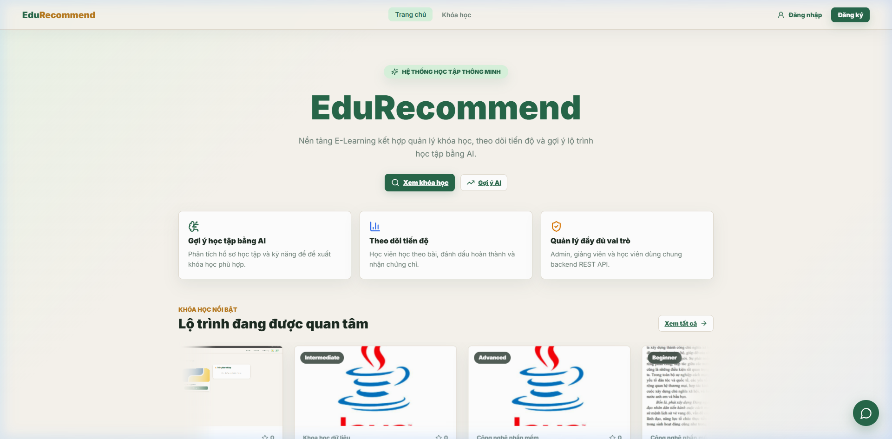
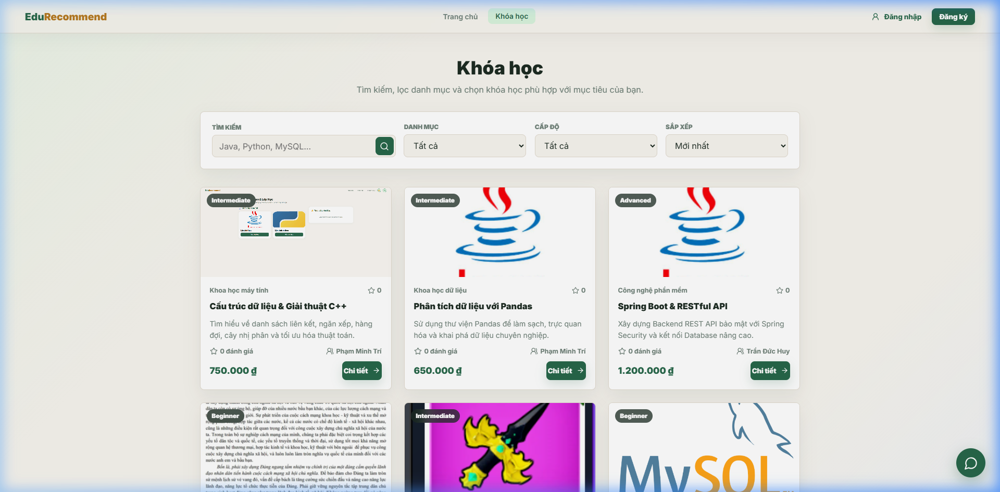

# 🎓 EduRecommend - E-Learning Platform & AI-Powered Course Recommendation System


---

## 📌 1. Overview

**EduRecommend** is an e-learning platform that combines **Data Mining (Apriori & KNN algorithms)** with **Generative AI Chatbot (Google Gemini API)** to provide personalized course recommendation paths for students based on their academic profile and market skill trends.

---

## 🌐 Multilingual README
*   [🇻🇳 Tiếng Việt (Vietnamese Version)](./README.md)

---

## 🏗️ 2. System Architecture

The project follows a modern Microservices & RESTful API architecture:

```
                  ┌─────────────────────────────────────┐
                  │          Frontend (Vue 3)           │
                  │   Vite + SPA + Responsive Layout    │
                  └──────────────────┬──────────────────┘
                                     │ REST API
                                     ▼
                  ┌─────────────────────────────────────┐
                  │       Backend (Spring Boot 4)       │
                  │   Java 26 + Spring Security + Data  │
                  └─────────┬─────────────────┬─────────┘
                            │                 │
             ┌──────────────┴──────┐   ┌──────┴───────────────┐
             ▼                     ▼   ▼                      ▼
  ┌──────────────────┐   ┌──────────────────┐   ┌──────────────────┐
  │   Database       │   │  AI Service      │   │  Google Gemini   │
  │   MySQL / H2     │   │  Flask (Python)  │   │  API Chatbot     │
  │   JPA / Hibernate│   │  Apriori + KNN   │   │  (Generative AI) │
  └──────────────────┘   └──────────────────┘   └──────────────────┘
```

---

## 📸 3. Application UI Screenshots

| Homepage View | Courses Catalog & AI Recommendation |
|:---:|:---:|
|  |  |

---

## 🔥 4. Key Features

### 👨‍🎓 Student Portal
- **Browse & Search Courses**: Filter by category, price, and ratings.
- **AI Recommendation Engine**: Complete a 17-parameter academic survey for personalized skill recommendations.
- **Cart & Checkout**: Apply discount coupons and process simulated payments.
- **Online Learning**: Watch unlisted YouTube video lessons and track completion progress.
- **Certificates & Reviews**: Auto-generate completion certificates and submit course reviews.
- **AI Chatbot Advisor**: Instant assistance regarding refund policies, course advice, and study roadmaps.

### 🛡️ Admin Dashboard
- **Course & Lesson Management (CRUD)**: Create, edit, and organize courses and video lessons.
- **Category & Coupon Management**: Create promo codes with usage quotas.
- **Refund Request Approvals**: Process and approve student refund requests.
- **Revenue Analytics**: Visual metrics covering overall revenue, enrolled students, and top-selling courses.
- **AI Service Monitoring**: Health checks monitoring the Python Flask AI service.

### 🏫 Teacher Portal
- **Course Management**: Submit requests to publish new courses (pending Admin review), update, or delete courses (with refund reasons for students).
- **Lesson Management (CRUD)**: Manage detailed video lessons inside self-owned courses.
- **Revenue & Enrollment Analytics**: Personal earnings dashboard from tuition commission and tracking registered students count.
- **Student Reviews**: View and reply to student feedback and rating reviews on self-owned courses.

---

## 🛠️ 5. Tech Stack

| Category | Technologies / Libraries |
|---|---|
| **Backend Core** | Java 26, Spring Boot 4.0.6, Spring Data JPA, Spring Security |
| **Database** | MySQL 8.0 (Production), H2 Database (In-memory Testing) |
| **Frontend** | Vue 3, Vite, ES6+ JavaScript, Vanilla CSS |
| **AI / Machine Learning** | Python 3.12, Flask, Pandas, Scikit-learn (KNN), Mlxtend (Apriori) |
| **AI Chatbot** | Google Gemini API (REST client) |
| **Testing** | JUnit 5, Mockito, AssertJ |
| **Container & CI/CD** | Docker, Docker Buildx, GitHub Actions |

---

## 📁 6. Project Directory Structure

```
E_LEARNING/
├── .github/
│   └── workflows/
│       └── ci.yml             # GitHub Actions CI/CD Pipeline
├── Edu_Recommend/
│   └── doan/                  # Spring Boot 4 Backend Project
│       ├── src/
│       │   ├── main/          # Backend Source Code (Controllers, Services, Repositories)
│       │   └── test/          # Unit Tests (JUnit 5 + Mockito)
│       ├── mvnw / mvnw.cmd    # Maven Wrapper
│       └── pom.xml            # Maven POM File
├── flask_api/                 # Python Flask AI Engine (Apriori + KNN)
│   ├── app.py
│   └── requirements.txt
├── frontend-vue/              # Vue 3 Single Page Application
│   ├── src/
│   │   ├── components/        # UI Components
│   │   ├── views/             # Views & Pages
│   │   └── services/          # API Services
│   └── package.json
├── docs/
│   └── screenshots/           # Captured Application UI Screenshots
├── Dockerfile                 # Multi-stage Docker build file (Amazon Corretto 26)
├── README.md                  # Vietnamese Documentation
└── README_EN.md               # English Documentation
```

---

## 🚀 7. Local Setup Guide

### Prerequisites:
- **JDK 26** or higher
- **Node.js** v18+ & **npm**
- **Python** 3.10+
- **MySQL** 8.0+

### ⚡ Automatic Packaged Single-URL Launch (Recommended)
The project comes with a convenient batch script to automatically build the Frontend and package it directly inside the Spring Boot static resources, running under port `8080`:

*   **Running on Windows:**
    Run the batch script from the root directory:
    ```bash
    .\run_packaged.bat
    ```

👉 **Single Access URL:** [**http://localhost:8080**](http://localhost:8080) (Vue Frontend + API Backend + AI automatically connected via Cloud)

---

### 🛠️ Option 2: Manual Step-by-Step Setup

#### Step 1: Start Backend (Spring Boot)
```bash
cd Edu_Recommend/doan

# Run with Maven Wrapper
./mvnw spring-boot:run
```
*(Backend runs at port `8080`)*

#### Step 2: Start Frontend (Vue 3)
```bash
cd frontend-vue

# Install dependencies
npm install

# Start Vite dev server
npm run dev
```
*(Frontend runs at `http://localhost:5173`)*

#### Step 3: Start AI Service (Flask)
```bash
cd flask_api

# Install dependencies
pip install -r requirements.txt

# Start Flask API
python app.py
```
*(Flask AI Engine runs at port `5000`)*

---

## 🐳 8. Docker Deployment

```bash
# Build Docker image
docker build -t edurecommend-backend:latest .

# Run Docker container
docker run -d -p 8080:8080 --name backend edurecommend-backend:latest
```

---

## ⚙️ 9. CI/CD Pipeline (GitHub Actions)

```
[ Git Push / Pull Request ]
            │
            ▼
 🧪 CI Job (Runs on all Branches)
    ├── Checkout Repository
    ├── Set up JDK 26 (Amazon Corretto)
    └── Run Unit Tests (./mvnw clean test)
            │
            ├── (If FAILED) ──► ❌ Stop Workflow
            │
            ▼ (If PASSED)
 🐳 CD Job (Runs only on Push/Merge to 'main')
    ├── Set up Docker Buildx
    ├── Log in to Docker Hub
    ├── Build Docker Image
    └── Push to Docker Hub (caoducmanh1611/edurecommend-backend:latest)
```

---

